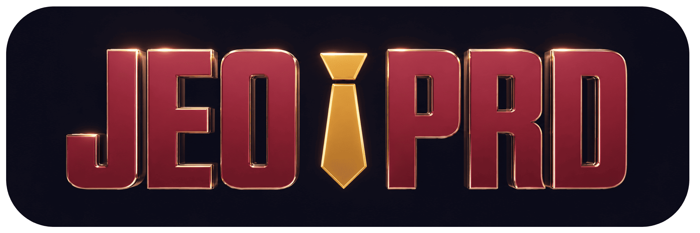
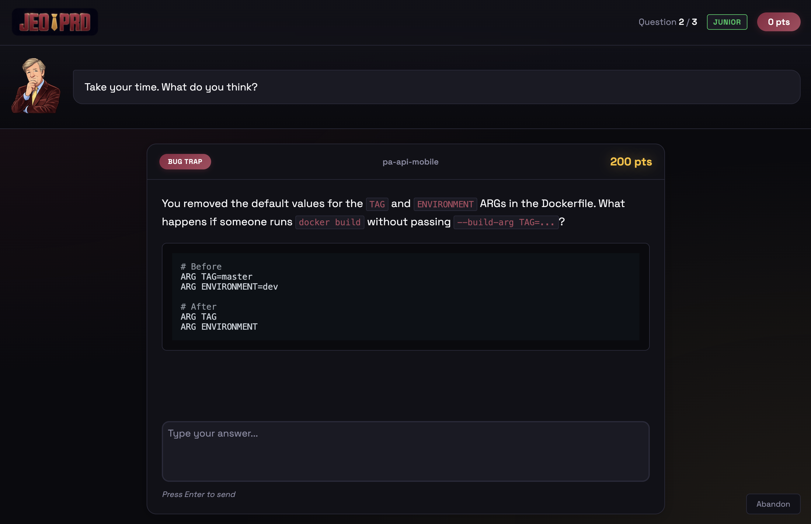
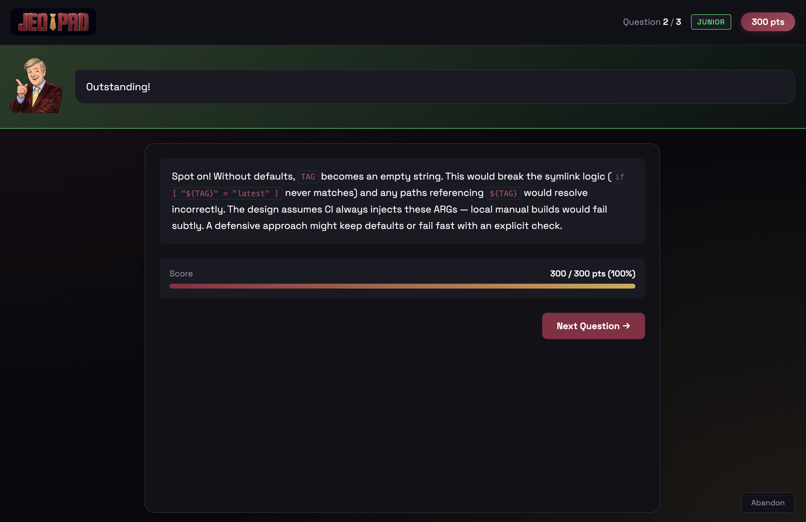
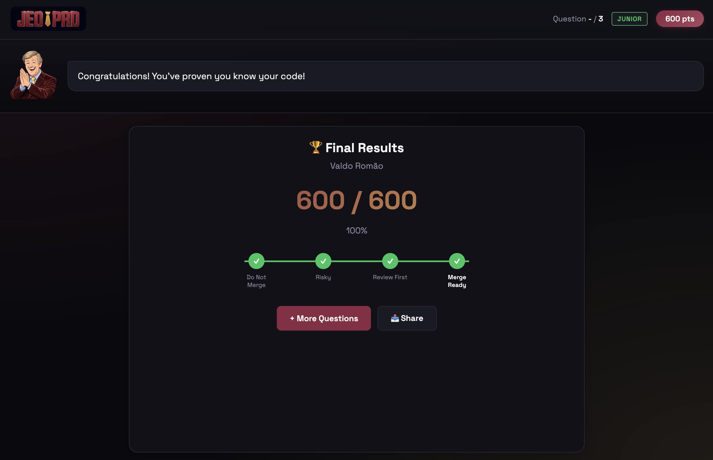
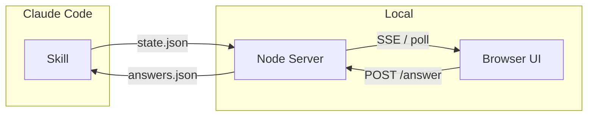

<p align="center">
  
</p>

<h3 align="center">The quiz show that tests if you REALLY understand your code before shipping</h3>

<p align="center">
  A Claude Code skill that quizzes you on your staged changes.<br>
  Prevents out-of-control-vibe-coding — no more merging code you can't explain.
</p>

---

<p align="center">
  
</p>

<details>
<summary>See more screenshots</summary>
<p align="center">
  
  <br><br>
  
</p>
</details>

## Install

```bash
# Global install (available in all projects)
git clone https://github.com/ValdoTR/jeo-prd ~/.claude/skills/jeo-prd
```

That's it. Run `/jeo-prd` in Claude Code.

<details>
<summary>Alternative: project-scoped install</summary>

```bash
# Commit to repo — shared with your team
mkdir -p .claude/skills
git clone https://github.com/ValdoTR/jeo-prd .claude/skills/jeo-prd
```

</details>

## Usage

```
/jeo-prd           → web UI opens, pick Junior or Senior
/jeo-prd junior    → 3 questions (basics, edge cases)
/jeo-prd senior    → 5 questions (architecture, security, failure modes)
```

The quiz analyzes your `git diff`, generates questions about your changes, and scores your understanding.

### Difficulty Levels

| Level | Questions | Focus |
|-------|-----------|-------|
| **Junior** | 3 | Edge cases, null handling, what the code does |
| **Senior** | 5 | Architecture decisions, security, failure modes, contracts |

### Verdict Scale

| Score | Status | Meaning |
|-------|--------|---------|
| ≥80% | ✅ Merge Ready | You understand your code |
| 60-79% | ⚠️ Review First | Some gaps, review before merging |
| 40-59% | 🔶 Risky | Significant gaps, consider pairing |
| <40% | 🚫 Do Not Merge | Major understanding gaps |

## How It Works

1. Run `/jeo-prd` in Claude Code
2. Web UI opens in your browser
3. Pick difficulty level
4. Answer questions about your staged changes
5. Get scored and see if you're ready to ship

Questions are generated from your actual diff — no generic trivia, just your code.

### Architecture



The skill uses files as IPC between Claude and the browser:
- **Claude → UI**: Writes quiz state to `.jeo-prd/state.json`, server watches and pushes to browser
- **UI → Claude**: Browser posts answers, server writes to `.jeo-prd/answers.json`, Claude's polling loop detects and reads

## Requirements

- [Claude Code](https://claude.ai/code) with Skills support
- Node.js (for the local web server)
- Git

## File Structure

```
jeo-prd/
├── SKILL.md              ← skill definition + orchestration
├── README.md
├── LICENSE               ← AGPL-3.0
├── CONTRIBUTING.md
├── assets/               ← logo + screenshots for README
└── server/
    ├── server.js         ← Node.js server (SSE + REST)
    ├── index.html        ← web UI
    └── images/           ← host avatar images
```

## Contributing

PRs welcome! See [CONTRIBUTING.md](./CONTRIBUTING.md).

**Art needed:** The host avatar images are AI-generated and it shows. If you're a digital artist and want to contribute better artwork, please open a PR with redesigned images — it would be hugely appreciated!

## License

**AGPL-3.0** — see [LICENSE](./LICENSE).

You may self-host, fork, and modify freely. If you run a modified version as a network service, you must offer your source code to users under the same license.
